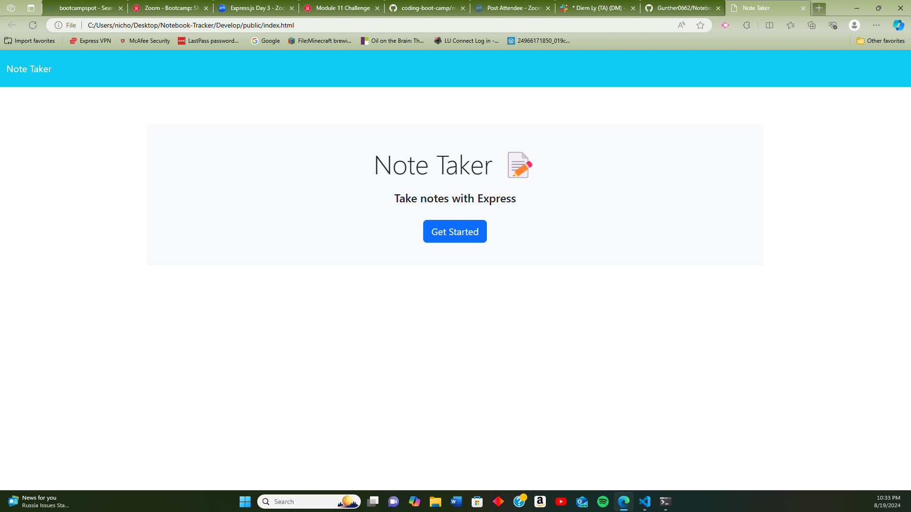

# Notebook-Tracker

## Description 

This application was design to make a virtual note tacker of the daily tasks that are needed to complete throught the day. It was design to make a more organized way to keep track of the daily tasks by implematating the express and html to make a fuctional way to orginize the code. Some of the obstacles that were develope on the way of creating this website would be how to get started on developing the code and how to implement the express file with the rest on the index.js and html.js.

## Table of contents

N/A

## Installation

The application would be developed in my GitHub rep[ositry which the link would be located on the usage section of my READ ME. As well as, it will be located on the repository Of Gunther0662 in the GitHub account.

## Usage

GitHub: https://github.com/Gunther0662/Notebook-Tracker

## Lincense

N/A

## Badges

N/A

## Features

N/A

## How to Contribute

N/A

## Tests

N/A

